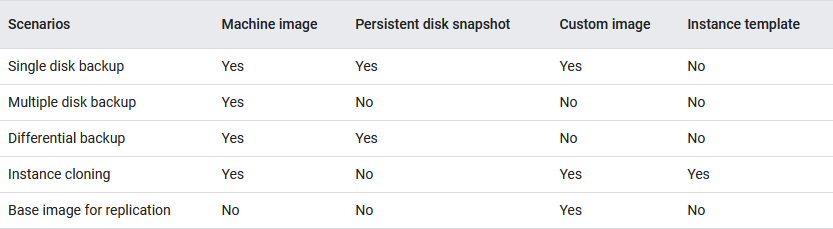

<!-- ------------------------------------------------------------------------------------------ -->
# Overview of Services
## Ingestion
- Pub/Sub: A global event-streaming service for ingesting data.

## Storage
- Cloud Storage: Scalable object-store for unstructured data.
- BigQuery: SQL-compatible, scalable, column-oriented data warehouse for structured data that is optimized for analytics workloads.
- Bigtable: Wide-column, scalable, NoSQL database for semi-strucutured data that supports high-volume low-latency writes and lookup by only a single row key.
- Firestore: Scalable NoSQL document database that supports more complex lookup than just a single row key.
- Cloud SQL: SQL-compatible relational database for transactional workloads that operates in a single region.
- Cloud Spanner: SQL-compatible relational database for transactional workloads that can operate in multiple regions.
- Memorystore: NoSQL in-memory key-value store similar to Redis.

## Transformation
- Dataprep: Web-based interactive tool for transforming data. Good for exploratory data analysis.
- Dataflow: Service for building batch and streaming pipelines using Apache Beam.
- Dataproc: Service for transforming data using Hadoop technologies like Spark.
- Cloud Data Fusion: A low-code/no-code ervice to build ETL data pipelines on top of Dataproc. Based on the open-source project CDAP.

## Compute
- Cloud Functions: Run a function in a serverless and scalable way.
- App Engine: Run an application that can support multiple services in a serverless and scalable way.
- Cloud Run: Run a container in a serverless and scalable way.
- Compute Engine: Managed service for creating virtual machines.
- Google Kubernetes Engine: A managed service for orchestrating containers.

## Access Management and Security
- IAM: Service authenticating identities and authorizing access to various resources.
- Cloud Key Management Service: Manage encryption keys.
- Secret Manager: Store API keys, passwords, certificates and other sensitive data.
- Cloud Identity: Manage authentication of identities with multi-factor authentication (MFA) and single sign-on (SSO).

## Logging
- Cloud Monitoring: Monitor and display custom log-based metrics or metrics from different services.
- Cloud Logging: Logging service for services and user-built applications.

# AI and Machine Learning
- AutoML: Automatically train models and tune hyperparameters.
- AutoML Tables: A machine learning service for structured data.
- BigQuery ML: Train and request predictions fro models all within BigQuery.
- Dialogflow: Create conversational user interfaces like chat bots.
- Kubeflow: An open source tool for running ML pipelines in Kubernetes.
- Speech-to-Text API converts spoken words to written words.
- Text-to-Speech API converts text to spoken words.
- Vertex AI: Train, deploy, and request predictions from models. Custom and automatic training through AutoML are available.

# Networking and Connectivity
- Cloud VPN: Connects a VPC network to another network.
- Cloud Interconnect: Provides low-latency and high-availability connections from on-premises networks to a VPC networks in the cloud for data transfer.
- Cloud Router: Dynamically change routes between VPC network and peer network.

# Misc
- Data Catalog: Service for metadata and data discovery.
- Data Loss Prevention (DLP): Service to discover and manage sensitive personal data like names, email, addresses, etc.
- Looker Studio/Data Studio: Build customizable reports and dashboards.
- Cloud Scheduler: Run jobs at regular intervals.
- Cloud Composer: Managed service for orchestrating different workflows using Apache Airflow.
- Cloud CDN: A content delivery network service designed to store copies of data close to end users.
- Resource Manager: Manage resources hierarchically; by project, folder, or organization.

# Privacy
- The **Payment Card Industry Data Security Standard (PCI DSS)** is a set of security standards designed to ensure that ALL companies that accept, process, store or transmit credit card information maintain a secure environment
- The **General Data Protection Regulation** is a regulation in EU law on data protection and privacy in the European Union and the European Economic Area.
- The **Health Insurance Portability and Accountability Act of 1996 (HIPAA)** is a federal law that requires the creation of national standards to protect sensitive patient health information from being disclosed.
- The **Children's Online Privacy Protection Act of 1998 (COPPA)** is a US federal law enforced by the Federal Trade Commission that regulates the online collection and use of personal information from children under the age of 13.
- The **Sarbanes-Oxley Act of 2002 (SOX)** is a US regulation on public companies designed to prevent fraudulent accounting practices.

<!-- ------------------------------------------------------------------------------------------ -->
# Notes
- **High availability** refers to the ability of a service to fail over to another instance in case of failure.
- **Scalability** refers to the ability of a service to handle variable amounts of workload usually by adding machines.
- A **geographic area** contains multiple **regions**. A region contains multiple **zones**.
- **Exponential backoff** is a retrying technique where each subsequent attempt to access a failed service waits exponentially longer to avoid an unnecessary number of requests.

<!-- ------------------------------------------------------------ -->
## Storage
- Decision tree for selecting storage solutions:\
    
    
- Denormalized relational data models: star and snowflake schemas
- Network models are used to model graph-like structures in graph databases.
- ACID is a set of properties of database transactions intended to guarantee data validity despite errors, power failures, and other mishaps.
    - Atomicity - multiple statements in a single transaction are treated as a single unit.
    - Consistency - all operations do not violate invariants, including constraints, cascade, triggers, primary key and foreign key relationships.
    - Isolation - concurrent operations will result in the same state as if the same operations were executed sequentially.
    - Durability - once a transaction is committed, it cannot be wiped by a system failure like a crash/power outage.

### BigQuery
- A column can be defined as a **repeated** field and store multiple values of the same type per cell.
- A column can be defined as a **nested*** field and store STRUCT types that contain multipe types of data.
- **BI Engine** caches SQL queries from any source in-memory to improve query performance.
- BigQuery allows querying external data sources. These queries are used to create **external tables**.
    - Allowable formats for creating external tables:
        - Avro
        - CSV
        - newline-delimited JSON
        - Datastore export files
        - Firestore export files
        - ORC
        - Parquet
- Pre-defined roles:
    - bigquery.dataOwner
    - bigquery.admin
    - bigquery.dataEditor
- Amount of data stored and frequency of refresh can increase costs of materialized views.
- Best practices:
    - Avoid SELECT *. Get only columns that you need.
    - Use LIMIT with clustered tables. This can reduce the amout of data scanned.
    - In a **partitioned** table, filter on the partitioned column.
    - In a **clustered** table, filter on the clustered column. Clustering a table requires partitioning it first.
    - Where applicable, use repeated and nested fields to pre-join and co-locate data.
    - To restrict access to certain columns in a table, a view can be created and saved in a different dataset with read-only access.
- `--dry-run` is used to estimate the number of bytes scanned.

### Bigtable
- Supports lookup only through a single row key.
- **Sparse** - no storage is used when a particular row x column combination has no data.
- Based on sparse multidimensional arrays. **Cassandra** is another database based on this.
- Put incrementing values towards the end of the row key to avoid hot spotting.
- Put columns frequently used together in a **column family**.
- Tables have rows and columns. **Cells** exist as another dimension in Bigtable. They store multiple values that are indexed by timestamp. When a cell is retrieved, Bigtable returns the value with the latest timestamp by default.
- Keep storage utilization per node below 60% for low latency applications.
- Distributes operations based on row keys.
- **HBase** is a column-oriented non-relational database management system that runs on top of Hadoop Distributed File System (HDFS).
- Provides an API compatible with HBase.
- **Hot spotting** occurs when workload is skewed toward a small number of nodes instead of being evenly distributed.
    - Hot spotting is usually caused by keys that are lexicographically similar, like an incrementing key.
    - **Key Visualizer** is a tool for analyzing usage patterns. It is good for troubleshooting hot spotting.
- An **instance** can contain multiple **clusters** in up to 8 regions. A cluster can contain multiple **nodes**.
- Nodes only store metadata that reference actual data stored in the storage system Colossus as SSTables. This allows fast rebalancing and fail over since only metadata has to be moved and only references to data need to be re-directed.
- An **app profile** specifies the routing policy that Bigtable should use for each request.
    - **Single-cluster routing** routes all requests to 1 cluster in your instance.
    - **Multi-cluster routing** automatically routes requests to the nearest cluster in an instance.
    - **Cluster group routing** sends requests to the nearest available cluster within a cluster group that you specify in the app profile settings.
- **Strong consistency** means that all applications accessing the database will see data in the same state.
- To optimize the performance of Bigtable, **replication** read and write operations can be separated.
    - Create one cluster for solely for write and another solely for read operations.
    - Create two app profiles to route read and write traffic to the two separate cluster appropriately.
    - Replication is **eventually consistent**, meaning that for some time, applications may see data in different states.
    - **Read-your-writes consistency** can be achieved for a certain group of applications by routing requests to the same cluster. All other app profiles must route requests to the same cluster. Other clusters can be used for other purposes.
    - Strong consistency can be achieved by configuring for read-your-writes consistency, BUT other clusters cannot be used except for fail over.
    - There is a tradeoff between consistency and latency. Strong consistency incurs higher latency.
- Bigtable store up to **10 MB per row**.
- Recommendations are that a table contain **no more than 100 column families**.

### Firestore
- Supports frequently-changing schemas and complex query patterns.
- An **entity** is analogous to a row in relational databases.
- **Kinds** are collections of entities analogous to tables in relational databases.
- **Indexes** are created to support different query patterns.
- Automatically creates atomic value ascending and descending indexes.
- Composite indexes are made up of two or more values and are created manually.
- **MongoDB** is another popular document database.
- `gcloud datastore export gs://some-bucket --async` creates backups and returns immediately while the backup job runs.

### Cloud Spanner
- Specify parent-child relationships between tables using foreign keys and table interleaving.
- **Primary indexes** are automatically created for the primary key.
- **Secondary indexes** can be created for other columns that are often filtered by in queries to avoid full table scans.
- **Interleaving** co-locates parent and child rows which improves performance.
- **Hot spotting** occurs when operations are skewed towards a few nodes instead of being evenly distributed.
    - Much like Bigtable, Cloud Spanner distributes operations based on primary keys.
    - To avoid hot spotting, the following can be employed:
        - Use the hash values of existing primary keys.
        - Bit-reverse sequential values.
    - The following are likely to cause hot spotting:
        - Auto-incrementing/sequential values.
        - Timestamps.
        - Low cardinality attributes.

### Cloud SQL
- A managed service for running relational databases like PostgreSQL, SQL Server and MySQL.
- Use **Cloud SQL Auth proxy** to connect to Cloud SQL.
- **Read replicas** can be used to improve the performance of the database by off-loading read operations from the primary instance.

### Cloud Storage
- Serves as a **data lake** for unstructured data.
- Stores data as **objects** in **buckets**. Buckets are associated with projects.
    - Bucket name is globally-unique and are associated with a physical location.
        - Can be multi-region.
        - Cannot change location or name after creation but data can be moved to another bucket.
        - Name can be reused once the bucket is deleted.
    - Buckets cannot be nested.
    - There are no filepaths. However, objects can be named to simulate a filepath as in gs://path/to/object.
        - Moving to a different "filepath" is just renaming the file.
- Redundancy and replication:
    - Redundant in at least 2 zones in a region area.
    - Multi-region and dual-region buckets are geo-redundant; stored in at least 2 different physical locations separated by 100 miles.
        - Default replication provides geo-redundancy in 1 hour.
        - Turbo replication provides geo-redundancy in 15 minutes.
- Co-locating VMs and buckets in the same region can improve performance.
- **Transfer Service** is designed to load terabytes of data using scheduled jobs and is well suited for transferring data from other public clouds.
- **Transfer Appliance** is designed for large data loads but requires attaching a storage device to the source system's network and so suitable only when you have physical access to the source system network.
- **Uniform bucket level access** uses IAM to apply permissions to buckets or groups of objects. This is the recommended method.
- **Fine-grained access control** is a legacy method based on access control lists. Not recommended.
- **Signed URLs** are used for time-limited access to an object.
- **Signed policy** documents are used to control what can be uploaded to a bucket.
- **Retention policies** specify how long files should be kept.
- **Retention policy** locks prevent changes to the retention period.
- **Object versioning** enables the retention of older versions of a file as noncurrent when it is replaced or deleted.
- #*NUMBER* appended at the end of a resource name indicates a specific generation of the object. **#0** refers to the most recent version.
- **Lifecycle policies** can be used to delete data. They are triggered when an object meets certain conditions. These conditions are:
    ```
    age
    createdBefore
    customTimeBefore
    daysSinceCustomTime
    daysSinceNoncurrentTime
    isLive
    matchesStorageClass
    matchesPrefix and matchesSuffix
    noncurrentTimeBefore
    numNewerVersions
    ```
- Storage classes:
    - Standard for frequently-accessed data
    - Nearline for data accessed at most once every 30 days
    - Coldline for data accessed at most once every 90 days
    - Archive for data accessed at most once every 365 days
    - Data can be redundant across regions if stored in **multi-regions** or **dual-regions**.
- `gsutil` is the command-line program to load data into Cloud Storage
- `gsutil rsync` is a command used to sync two buckets/directories.

<!-- ------------------------------------------------------------ -->
## Transformation

### Dataproc
- The number of master nodes cannot be changed once a cluster has been created. The cluster will have to be re-created.
- **Secondary workers** are machines that are used only for processing and not storage.
- Clusters can be created on a **sole tenant node** to keep the cluster's VMs physically separate from VMs in other projects. This addresses security and compliance concerns.
- An **Autoscaling Policy** can be used to increase the size of the cluster by adding nodes.
- In addition to the boot disk, **SSDs or solid state drives** can be added to VMs to improve read/write performance.
- The **Cloud Storage connector** is an open source Java library that lets you run Apache Hadoop or Apache Spark jobs directly on data in Cloud Storage.
- Instead of using HDFS, use Cloud Storage for storing files, which allows data to be accessed even when the cluster is shut down.
- `FetchFailedException` is an error that occurs when shuffle data is lost, likely due to a node being decommissioned.
- When creating a cluster, `dataproc:dataproc.scheduler.max-concurrent-jobs` can be set to limit the number of concurrent jobs.
- **HDFS** is the Hadoop Distributed File System. It's a file system whose data is stored in a cluster of machines.
- Use **ephemeral** clusters where possible. It is recommended to configure a cluster for a specific type of job, spin up the cluster, run the job, and stop the cluster. This way, cluster configuration can be optimized for the specific job and users can save on costs by not having clusters with low usage.
- The number of preemptible workers should be less than **50%** of total workers in the cluster.
- `roles/dataproc.editor` will provide permissions to stop clusters, initiate workflow templates, and other common user tasks.
- `gcloud dataproc clusters update --num-secondary-workers` updates the number of secondary workers in a node.
- `gcloud clusters dataproc create --gce-pd-kms-key` specifies the key used to protect the cluster.

### Dataflow
- Based on the **Apache Beam** open-source project.
- Because streaming data can be unbounded, a **window** is specified to bound data to be analyzed.
    - sliding (hopping): Every 5 minutes, compute the average in the last hour. Can overlap.
    - fixed (tumbling): Every hour, compute the average. Cannot overlap.
    - session: For the time that a user was active, compute the average. Start and end intervals depend on external events.
    - single **global window**: For data that is bounded and to be analyzed in a single window.
- **Apache Beam** is analogous to this service. It implements and Apache Beam runner.
- **Watermark** is a time after the end time of a window after which no more late-arriving data is accepted into the window's computation.
- A **PCollection** represents key-value pair data in a distributed fashion.
- A **side input** is an additional input that your `DoFn` can access each time it processes an element in the input PCollection.
- A **custom window** is created using WindowFn functions to implement windows based on data-driven gaps.
- **FlexRS** or flexible resource scheduling reduces batch processing costs using scheduling techniques and preemptible VMs.
- Runs distributed jobs on worker virtual machines. These machines use persisten disks to store window state and shuffle storage.
- Instead of running distributed jobs on VMs, the backend service **Streaming Engine** can be used to run the same distributed jobs with better autoscaling and reduced resource usage.
- **Dataflow Shuffle** is a backend service that can offload shuffle processing (GroupByKey, CoGroupByKey, Combine) from VMs. Only available in batch jobs. Used by batch jobs by default.
- **Cancel** shuts down a pipeline. **Drain** stops the flow of new data but allows current data to complete processing.
- Core Beam transforms:
    - ParDo: generic parallel processing
    - GroupByKey: aggregate values by key
    - CoGroupByKey: relational join
    - Combine: combine data like summing
    - Flatten: merge multiple PCollections into a single PCollection; like creating a single list from a list of lists
    - Partition: split a PCollection
- Metrics:
    - **job/system_lag** is the maximum duration that an item has been waiting in the pipeline.
    - **job/data_watermark_age** is the age of the most recent item that's been fully processed by the pipeline.
    - **job/elapsed_time** is the elapsed time of the pipeline run time.
    - **job/element_count** is the number of items processed in a PCollection for the Read_input and Process_element transforms.
- `gcloud dataflow sql query` executes the query on Dataflow.
- **--maxNumWorkers** is used to limit the resources used by a pipeline.

<!-- ------------------------------------------------------------ -->
## Compute

### Compute Engine (CE)
- An **instance** is a virtual machine (VM).
- A **Managed Instance Group** (MIG) is a group of virtual machines that were created based on a template. Machines are all of the same type. Supports autoscaling.
- An **unmanaged instance group** can contain machines of different types. Does NOT support autoscaling.
- An **instance template** is a resource that you can use to create virtual machine (VM) instances and managed instance groups (MIGs).
- A **machine image** is a resource that stores all the configuration, metadata, permissions, and data from multiple disks of a virtual machine (VM) instance.
- **Snapshots** incrementally back up data from your persistent disks. After you create a snapshot to capture the current state of the disk, you can use it to restore that data to a new disk.
- A **custom image** is a boot disk image that you own and control access to.
- When to use images vs snapshots vs templates:\
    
    - Instance templates can only be used to create the VMs. They do not specify what is installed on the boot disk or what data is present on disks.
    - On the other hand, snapshots apply only to disks. They do not contain configurations for VMs.
    - Images store the state of the boot disk.
    - Custom images can be created to store configuration work and used as a base image for replicating VMs.
    - Machine images are used to completely clone a VM.
- **Shielded VMs** offer verifiable integrity of your VM instances, so you can be confident your instances haven't been compromised by boot- or kernel-level malware or rootkits.
- **Preemptible VMs** are virtual machines that are excess capacity. They are available at discounts but can be stopped (preempted) when CE needs to reclaim capacity.
- A **sole-tenant** node is a server that is dedicated to hosting your project's VMs only.

### Cloud Functions
- `gcloud functions deploy` is used to create a cloud function.

### Google Kubernetes Engine (GKE)
- **deployment.yaml** files are used to configure deployments.
- `kubectl scale deployment --replicas` will scale a deployment to 4 replicas.

<!-- ------------------------------------------------------------ -->
## Networking
- **Virtual Private Cloud (VPC) networks** is a virtual version of a physical network, implemented inside of Google's production network, using Andromeda.
- **DNS A records** associate an IP address with a domain name.

### Cloud VPN
- Used to connect two networks, one of which must be a VPC network in the cloud.

### Cloud Interconnect
-  Provides low latency, high availability connections that enable you to reliably transfer data between your on-premises and Google Cloud Virtual Private Cloud (VPC) networks.
- ***Dedicated Interconnect** provides a direct physical connection between your on-premises network and Google's network.
- ***Partner Interconnect** provides connectivity between your on-premises and VPC networks through a supported service provider.

<!-- ------------------------------------------------------------ -->
## Logging

### Cloud Logging
- Only keeps logs for 30 days.
- Logs can be routed to other sinks like Cloud Storage, Pub/Sub, and BigQuery.
- Types of Audit Logs
    - Admin Activity audit logs contain log entries for API calls or other actions that modify the configuration or metadata of resources.
    - Data Access audit logs contain API calls that read the configuration or metadata of resources, as well as user-driven API calls that create, modify, or read user-provided resource data.
    - System Event audit logs contain log entries for Google Cloud actions that modify the configuration of resources.
    - Policy Denied audit logs are recorded when a Google Cloud service denies access to a user or service account because of a security policy violation.

<!-- ------------------------------------------------------------ -->
## Access Management and Security
- An **organization** can contain many **folders**. A folder can contain many **projects**. These inherit policies hierarchically.
- Billing of services occurs at the project level.
- Data in GCP is encrypted in transit and at rest automatically. Google also automatically handles the management of these encryption keys.
- Encryption of data at rest occurs at multiple levels:
    - **Platform level** uses AES256 and AES128 encryption
    - **Infrastructure level** uses AES256 encryption
    - **Hardware level** uses AES256 and AES128 encryption

### IAM
- **Authentication** is proving who you say you are.
- **Authorization** is defining what you can and cannot do.
- **Google Workspace Identity** should be used to identify human users.
- **Service accounts** are identities that represent user-built programs and other cloud services.
- **User accounts** are identities that represent human users.
- A **principal** is an identity or groups of identities that will access and use resources.
- **Permissions** authorize principals to perform operations on resources.
- **Roles** are collections of permissions.
- **Role bindings** grant roles to principals, allowing principals to execute operations authorized by the role's permissions.
- **Policies** are collections of role bindings.
- **Service account keys** can be used to authenticate service accounts. They key pair is created; public key is stored in IAM and the private key is stored elsewhere for the application to use. When a request is made using the private key, IAM uses the public key to verify the private key.
- According to the **principle of least privilege**, grant only the necessary permissions to users and service accounts.
- To authorize a principal to do (x, y, z), a role is created that contains permissions for (x, y, z). This role is then granted to the principal through a policy binding.
- A GCP service Service1 that is not authorized to use another GCP service Service2 indicates that Service1 must be granted the Service Account User role.

### Cloud Key Management Service (KMS)
- **Customer Managed Encryption Keys (CMEKs)** allow customers to manage their own keys in GCP.
- **Customer Supplied Encryption Keys (CSEKs)** allow customers to supply their own encryption keys.
- **Cloud External Key Manager (EKM)** facilitates the use of keys that are already managed by a key manager not in GCP.

<!-- ------------------------------------------------------------ -->
## AI and Machine Learning

### Machine Learning Terms
- In **supervised** learning, models use data that has been labeled to predict something.
- In **unsupervised** learning, models find patterns in data without labels.
- **Reinforcement** learning is a technique that trains **agents** to take actions that maximize a reward or minimize consequences.
- **Regression** is a supervised learning problem type that maps data to continuous values.
- **Classification** is a supervised learning problem type that maps data to discrete values.
- **Clustering** is an unsupervised learning problem type that divides the data into groups called clusters. New data is then assigned to these clusters.
- An **instance** is a single row of data with multiple columns.
- In supervised learning, a **target** is a column of data that the model tries to predict.
- A **feature** is a column of data that is used by the model to find patterns/predict the target.
- **Overfitting** is a condition where a model performs well on training data but poorly on test data.
- **Underfitting** is a condition wehere a model performs poorly on training data.
- **Regularization** is a collection of techniques that prevent overfitting.
    - **L2 or Ridge regularization** prevents large coefficients.
    - **L1 or Lasso regularization** can drive the coefficients of features that have no predictive value to 0.
    - In deep learning, **dropout** is randomly ignoring some neurons during training to prevent overfitting.
- **Feature crosses** is a way to create synthetic features from existing features (kind of like multiplying two features in linear regression). It is useful when the data set has few features but many instances or when a model is underfitting due to lack of features.
- **Gradient descent** is a way to find the minimum of a function by moving in the direction where the derivative is most negative (steep).
- **Backpropagation** is a widely used algorithm for training neural networks that uses the error and rate of change of the error to calculate weight adjustments. Gradient descent is often used to calculate these weight adjustments.
- **Deep Learning** is a machine learning technique inspired by biological neural connections. It uses layers of **perceptrons** represent models.
- **TensorFlow** is a deep learning framework developed by Google.

### Machine Learning Metrics
- **Accuracy** is a classification metric. Of all the predictions, how many are actually true?
- **Precision** is a classification metric. Of all the predictions that are true, how many are actually true?
- **Recall** is a classification metric. Of all the actual instances that are true, how many did the model predict as true?
- **F-score** is a classification metric the harmonic mean precision and recall.

### Machine Learning Hardware
- The **von Neumann bottleneck** occurs because an instruction fetch and data operation cannot happen at the same time due to architecture. This limits processor performance.
- **Central Processing Units (CPUs)** are chips that comprise the main computing facility in modern personal computers. They can be used to perform machine learning computations.
    - Good for prototyping or simple models.
    - Good for models that heavily rely on custom TensorFlow operations written in C++.
    - Good for models that run on servers limited by I/O operations and network bandwith.
- **Graphics Processing Units (GPUs)** are chips that specialize in rendering graphics. They can be used to accelerate machine learning computations.
    - Good for models not built on TensorFlow, especially when source code is inaccessible or is difficult to modify.
    - Good for models that must run some custom TensorFlow operations on CPUs.
    - Good for medium to large models.
    - Good for models that require high-precision arithmetic.
    - Good for models that have operations not supported by TensorFlow.
- **Tensor Processing Units (TPUs)** are proprietary chips developed by Google for the TensorFlow framework.
    - Perform low-precision computations to increase throughput.
    - Perform matrix multiplications in the processor.
    - Faster than GPUs.
    - Good for very large models.
    - Cannot be used outside of TensorFlow or when custom operations exist in the main training loop.
    - Not suitable for high-precision arithmetic.
- Training a Tensorflow model using Compute Engine with a GPU requires the GPU's drivers to be installed. Deep Learning VM images are pre-configured to install GPU drivers.

<!-- ------------------------------------------------------------ -->
## Misc

### Cloud Composer
- **Airflow** is a framework for orchestrating workloads.
- A **task** is an atomic unit of work represented by operators.
- The order in which tasks are performed are specifed in a **Directed Acyclic Graph (DAG)**.
- Python is used to build these DAGs.

### Data Catalog
- Used to tag data to support data discovery.
- Used to store analysis and tagging of PII and sensitive data.
- Can automatically extract metadata from sources like: Cloud Storage, BigQuery, Bigtable, Pub/Sub, and Google Sheets.

### Data Loss Prevention
- Detects sensitive information in text and images.
- Redacts or masks sensitive information.
- Performs re-identification risk analysis (or **risk analysis**) to identify properties or **quasi-identifiers**, like age or postal code, that can re-identify a person even in redacted data.
- Uses pattern detection techniques. Patterns are defined as **InfoType detectors**.
- **PII** stands for Personally Identifiable Information.

### Data Studio/Looker Studio
- Used to build custom reports and dashboards.
- Live data sources are connections to the source data without importing any data into Looker.
- Extracted data sources are snapshots that are stored in an in-memory cache and can provide better performance.
- File upload data sources import CSV data into Looker.
- Blended data sources combine data from multiple sources in the same visualization.
- Caching
    - **Query caches** are is associated with report components, not with data sources. When a component generates a query, it checks the query cache and returns if there is a cahce hit. Components cache only the data they need to display their visualizations.
    - **Pre-fetch caching** is a feature where data studio anticipates the data needed and fetches it from the underlying data source before the data is requested.
    - The data in the cache can be old. Refresh the cache if new data is not being displayed.

### Pub/Sub
- TODO: read documentation
- Typically used as the first service to ingest high-volume streaming data.
- A **topic** is an append-only log that producers can publish to and consumers can subscribe to.
- To access the data in Pub/Sub, an application uses a **subscription**. A topic can have multiple subscriptions but a subscription can only be for one topic.
    - In a **push subscription**, Pub/Sub accesses an endpoint to send data. Used when multiple topics need to be processed by the same webhook.
    - In a **pull subscription**, the application sends a request to Pub/Sub to access the data. This is used when efficiency and throughput of message processing is critical.
    - In a **BigQuery subscription**, data is written to an existing BigQuery table as they are received.
- **Apache Kafka** is an open-source alternative to this service.
- **At least once** delivery guarantee. Data will be delivered to at least one consumer in every subscription to a topic.
- Keeps data for 7 days by default. This retention period can be changed.
- Once a consumer for each subscription to a topic has acknowledged receipt of a message, the message will be deleted from storage.
- Can deliver data out of order and can deliver duplicates. Use in conjunction with Dataflow if you need data to be in order and to deduplicate.
- **subscription/num_undelivered_messages** is a metric that indicates how well subscribers are keeping up with data being ingested.
- Define a schema during topic creation to ensure  to ensure messages are written with a standard structure.
- Supports Protocol Buffer (ProtoBuf) and Avro formats for schema definition.
- **Thrift** is an alternative to ProtoBuf.
- **Parquet** is an open-source column-oriented format used in Hadoop systems.

### Resource Manager
- Resources in an organization can be restricted to certain locations by setting a Resource Location Restriction policy.
- **constraints/iam.disableServiceAccountKeyCreation** is enabled and that prevents principals from creating user-managed service account keys.
- Enabling **constraints/iam.disableServiceAccountKeyCreation** prevents principals from creating user-managed service account keys.

<!-- ------------------------------------------------------------------------------------------ -->
# Useful Links
- Data engineering code demos: https://github.com/GoogleCloudPlatform/training-data-analyst/tree/master/courses/data-engineering/demos
